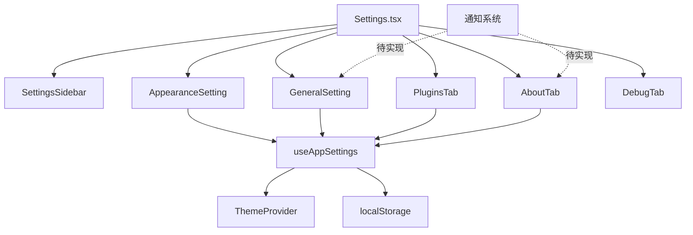

# 设置页面功能 - 全局架构分析文档

## 1. 任务概述

- **复杂度评级**: L2（中等）
- **输入源**: 
  - `src/components/Settings.tsx` - 主设置页面组件
  - `src/components/settings/` - 所有设置子组件
  - `src/hooks/useAppSettings.ts` - 应用设置 Hook
  - `src/components/providers/ThemeProvider.tsx` - 主题提供者
- **输出目标**: 完善设置页面中缺失的功能模块

## 2. 现有资源分析

### 2.1 已实现的设置组件

| 组件名称 | 文件路径 | 状态 | 功能描述 |
|---------|---------|------|---------|
| SettingsSidebar | `settings/SettingsSidebar.tsx` | ✅ 已实现并集成 | 左侧导航栏，包含5个标签页 |
| AppearanceSetting | `settings/AppearanceSetting.tsx` | ✅ 已实现并集成 | 外观设置：主题切换、跟随系统、语言选择 |
| GeneralSetting | `settings/GeneralSetting.tsx` | ✅ 已实现并集成 | 通用设置：开机启动、托盘图标、快捷键显示、重置设置 |
| PluginsTab | `settings/PluginsTab.tsx` | ✅ 已实现并集成 | 插件管理：插件列表、固定/卸载插件 |
| AboutTab | `settings/AboutTab.tsx` | ✅ 已实现并集成 | 关于页面：版本信息、技术栈、重置设置 |
| DebugTab | `settings/DebugTab.tsx` | ✅ 已实现并集成（仅开发环境） | 调试面板：开发者选项、数据导出 |

### 2.2 已实现但未集成的功能

根据代码分析，以下功能已在 `useAppSettings.ts` 中定义，但**缺少对应的UI控件**：

1. **窗口透明度设置** (`windowOpacity: 0.5 - 1.0`)
   - Hook已实现：`applyWindowOpacity()` 函数
   - CSS变量已设置：`--window-opacity`
   - ❌ **缺失UI**：没有滑块或输入框让用户调整透明度

2. **布局密度设置** (`layoutDensity: 'compact' | 'comfortable'`)
   - Hook已定义该字段
   - ❌ **缺失UI**：没有下拉选择或开关让用户切换布局密度
   - ❌ **缺失应用逻辑**：没有实际使用 `layoutDensity` 的代码

3. **动画开关** (`enableAnimations: boolean`)
   - Hook已实现：`applyAnimations()` 函数
   - CSS类已设置：`.reduce-motion`
   - ❌ **缺失UI**：没有开关让用户启用/禁用动画

4. **全局快捷键设置** (`globalShortcut: string`)
   - Hook已定义该字段
   - App.tsx 中已注册快捷键
   - ❌ **缺失UI**：只显示当前快捷键文本，没有编辑功能

### 2.3 完全缺失的功能

以下功能在项目中**完全没有实现**：

1. **通知/Toast系统**
   - `src/utils/notifications.ts` 已定义API
   - ❌ **缺失UI组件**：没有全局通知组件监听 `show-notification` 事件
   - ⚠️ **违反约定**：`GeneralSetting.tsx` 和 `AboutTab.tsx` 仍在使用 `window.confirm()`

2. **确认对话框组件**
   - `notifications.ts` 中定义了 `confirmAction()` API
   - ❌ **缺失UI组件**：没有全局确认对话框组件监听 `show-confirmation` 事件

## 3. 依赖关系

### 3.1 核心依赖



### 3.2 数据流

1. **设置读取流程**：
   ```
   组件挂载 → useAppSettings() → localStorage读取 → 返回settings对象
   ```

2. **设置更新流程**：
   ```
   用户操作 → updateSetting/updateSettings → 更新state → useEffect触发 → 写入localStorage → 应用副作用（主题/动画/透明度）
   ```

3. **主题同步流程**：
   ```
   ThemeProvider监听theme变化 → 同步到useAppSettings → 写入localStorage
   useAppSettings监听syncWithSystemTheme → 监听系统主题变化 → 调用setTheme
   ```

## 4. 关键映射

### 4.1 设置字段与UI映射表

| 设置字段 | 类型 | 默认值 | UI组件状态 | 所在标签页 |
|---------|------|--------|-----------|-----------|
| `autoStart` | boolean | false | ✅ Switch | general |
| `theme` | 'light' \| 'dark' | 'light' | ✅ Button组 | appearance |
| `syncWithSystemTheme` | boolean | false | ✅ Switch | appearance |
| `language` | 'zh-CN' \| 'en-US' | 'zh-CN' | ✅ Select | appearance |
| `showTrayIcon` | boolean | true | ✅ Switch | general |
| `enableAnimations` | boolean | true | ❌ 缺失 | - |
| `windowOpacity` | number (0.5-1.0) | 0.98 | ❌ 缺失 | - |
| `layoutDensity` | 'compact' \| 'comfortable' | 'comfortable' | ❌ 缺失 | - |
| `globalShortcut` | string | 'Ctrl+Space' | ⚠️ 只读显示 | general |

### 4.2 符号映射检查

本项目未使用 `.lingma/index/symbol_map.json`，无需进行符号映射。

## 5. 实现要点

### 5.1 需要新增的UI组件

#### Module 1: 外观增强设置（Module 1）
- **位置**：在 `AppearanceSetting.tsx` 中添加
- **功能**：
  1. 动画开关（Switch组件）
  2. 布局密度选择（Select或Radio Group）
  3. 窗口透明度滑块（Slider组件）

#### Module 2: 快捷键编辑器（Module 2）
- **位置**：新建 `settings/ShortcutEditor.tsx` 或在 `GeneralSetting.tsx` 中扩展
- **功能**：
  1. 快捷键录制器（监听键盘事件）
  2. 快捷键验证（防止冲突）
  3. 快捷键保存和同步到后端

#### Module 3: 通知系统（Module 3）
- **位置**：新建 `components/NotificationProvider.tsx`
- **功能**：
  1. 全局通知组件（监听 `show-notification` 事件）
  2. Toast显示动画
  3. 自动消失功能
  4. 支持success/error/warning/info四种类型

#### Module 4: 确认对话框（Module 4）
- **位置**：新建 `components/ConfirmationDialog.tsx`
- **功能**：
  1. 全局确认对话框（监听 `show-confirmation` 事件）
  2. 模态遮罩层
  3. 确定/取消按钮
  4. Promise-based API

### 5.2 需要修复的问题

#### Issue 1: 替换 window.confirm()
- **文件**：`GeneralSetting.tsx` (line 10), `AboutTab.tsx` (line 61)
- **问题**：违反项目约定 v1.4（禁止使用原生对话框）
- **解决方案**：使用 `confirmAction()` API替代

#### Issue 2: layoutDensity 未实际应用
- **问题**：设置了CSS变量但没有实际使用
- **解决方案**：
  1. 在全局CSS中定义不同密度的样式类
  2. 根据 `settings.layoutDensity` 动态添加/移除类名

### 5.3 性能优化建议

1. **防抖处理**：
   - 窗口透明度调整应使用防抖（debounce），避免频繁更新CSS变量
   - 建议延迟时间：300ms

2. **懒加载**：
   - DebugTab 仅在开发环境渲染，已正确实现
   - 其他标签页可以考虑懒加载（如果未来增加更多标签页）

3. **记忆化**：
   - `AppearanceSetting` 中的 `currentLanguage` 已使用 `useMemo`，符合要求
   - 其他组件中的计算属性也应考虑使用 `useMemo`

## 6. 引用约定

### 6.1 user-conventions.md 相关条款

- **2.1 命名规范**：
  - 变量名使用 camelCase（如 `windowOpacity`、`layoutDensity`）✅ 已遵循
  - 组件名使用 PascalCase（如 `AppearanceSetting`）✅ 已遵循
  - 布尔变量以 `is`、`has`、`can` 开头（如 `isPluginPinned`）✅ 已遵循

- **2.3 React + TypeScript 特定约定**：
  - 组件使用函数式组件 + Hooks ✅ 已遵循
  - Props 接口命名为 `[ComponentName]Props` ✅ 已遵循
  - 自定义 Hooks 以 `use` 开头（如 `useAppSettings`）✅ 已遵循
  - 禁止使用 `any` 类型 ⚠️ 需要检查

- **2.5 错误处理**：
  - 所有异步操作必须包含错误处理 ✅ `useAppSettings` 中有 try-catch
  - 禁止空的 catch 块 ✅ 已记录日志

- **4. 文档要求**：
  - 公共 API 必须有 JSDoc/tsdoc 注释 ⚠️ 部分组件缺少注释

### 6.2 project-conventions.md 相关条款

- **2.4 用户交互规范**：
  - 禁止使用 `alert()` 和 `confirm()` 原生对话框 ❌ **违规**：2处使用 `window.confirm()`
  - 应使用 Toast、Modal 或自定义对话框组件 ❌ **缺失**：通知系统未实现UI

- **2.5 TypeScript 类型安全**：
  - 禁止使用 `as any` 类型断言绕过类型检查 ⚠️ 需要全面检查

## 7. 风险评估

### 7.1 高风险项

1. **快捷键编辑器实现复杂度高**
   - 需要监听全局键盘事件
   - 需要处理组合键（Ctrl+Alt+Shift+Key）
   - 需要与后端同步（Tauri全局快捷键注册）
   - **建议**：先实现简化版，后续迭代完善

2. **通知系统需要全局状态管理**
   - 需要在App根组件挂载监听器
   - 需要管理多个Toast的显示/隐藏
   - **建议**：使用Context或自定义Hook管理

### 7.2 中风险项

1. **layoutDensity 需要全局CSS支持**
   - 需要修改Tailwind配置或全局样式
   - 可能影响多个组件的间距和尺寸
   - **建议**：先在小范围测试，确认效果后再全面应用

2. **透明度调整可能影响性能**
   - 频繁更新CSS变量可能导致重绘
   - **建议**：使用防抖，限制更新频率

### 7.3 低风险项

1. **动画开关实现简单**
   - 已有 `applyAnimations()` 函数
   - 只需添加Switch组件
   - **建议**：优先实现

2. **替换 window.confirm()**
   - API已定义，只需实现UI组件
   - **建议**：与通知系统一起实现

## 8. 下一步行动

根据复杂度评估，建议按以下顺序实施：

1. **Module 3: 通知系统**（L2）- 解决违规问题，为其他模块提供基础
2. **Module 4: 确认对话框**（L1）- 依赖通知系统，快速修复违规
3. **Module 1: 外观增强设置**（L2）- 完善外观设置，提升用户体验
4. **Module 2: 快捷键编辑器**（L3）- 最复杂，最后实现

每个模块的详细规划见对应的 `plan_module_X.md` 文档。
