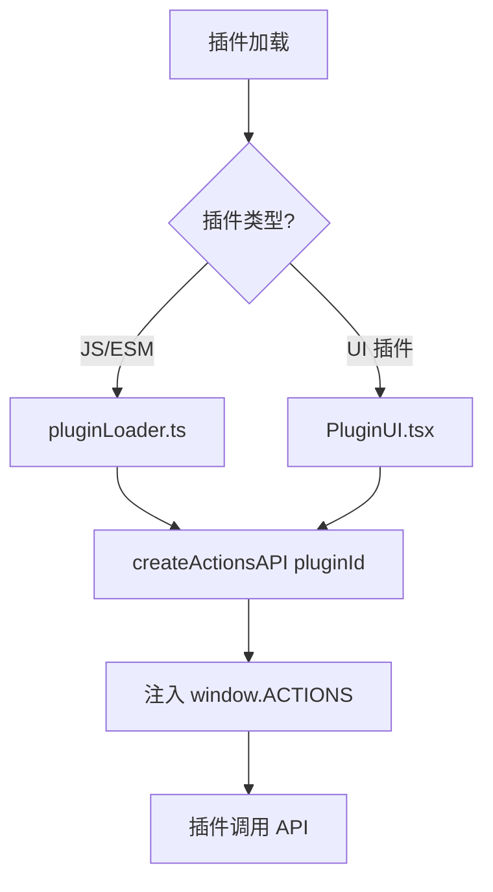

# API 重构说明 - 统一插件 API

## 📋 概述

本次重构将 `pluginAPI.ts` 和 `actionsAPI.ts` 两个文件合并为统一的 `actionsAPI.ts`，消除冗余代码，简化维护。

---

## 🔍 问题分析

### 之前的状态

项目中有两个类似的 API 文件：

| 文件 | 功能 | 使用位置 |
|------|------|----------|
| `pluginAPI.ts` | 基础 API (5个模块) | `pluginLoader.ts`, `usePlugins.ts` |
| `actionsAPI.ts` | 完整 API (10个模块) | `PluginUI.tsx` |

**问题**：
1. ❌ **代码冗余** - 相同的功能在两个文件中重复实现
2. ❌ **维护困难** - 修改 API 需要同步更新两个文件
3. ❌ **混淆开发者** - 不清楚应该使用哪个 API
4. ❌ **不一致的行为** - 相同功能可能有不同的实现

### 重复的功能

- ✅ `fs.listDir` - 列出目录
- ✅ `shell.execute` - 执行命令
- ✅ `notification.show` - 显示通知
- ✅ `clipboard.writeText/readText` - 剪贴板操作
- ✅ `everything.search/open/revealInFolder` - Everything 搜索

### 独有的功能

- `pluginAPI.ts` 独有：`fs.readFile`, `fs.writeFile`
- `actionsAPI.ts` 独有：`http`, `config`, `utils`, `storage`, `plugin` 元数据

---

## ✅ 解决方案

### 决策：保留 `actionsAPI.ts`，删除 `pluginAPI.ts`

**理由**：
1. ✅ `actionsAPI.ts` 功能更完整（10个模块 vs 5个模块）
2. ✅ `actionsAPI.ts` 有更好的类型定义和文档注释
3. ✅ `actionsAPI.ts` 包含完善的错误处理
4. ✅ `actionsAPI.ts` 已经在新的 PluginUI 架构中使用

### 执行步骤

#### 1. 补充缺失功能到 `actionsAPI.ts`

添加了 `pluginAPI.ts` 中独有的功能：
- ✅ `fs.readFile` - 读取文件内容
- ✅ `fs.writeFile` - 写入文件内容

**代码变更** (`src/utils/actionsAPI.ts`):
```typescript
interface FileSystemAPI {
  readFile: (path: string) => Promise<string>;      // 新增
  writeFile: (path: string, content: string) => Promise<void>;  // 新增
  listDir: (path: string) => Promise<any[]>;
  getInfo: (path: string) => Promise<any>;
  searchFiles: (path: string, query: string, maxResults?: number) => Promise<any[]>;
}
```

#### 2. 更新引用 `pluginAPI.ts` 的文件

**修改的文件**：
- ✅ `src/utils/pluginLoader.ts` - 改用 `createActionsAPI`
- ✅ `src/hooks/usePlugins.ts` - 改用 `createActionsAPI`

**变更前**：
```typescript
import { createPluginAPI } from './pluginAPI';
const api = createPluginAPI(plugin.id);
```

**变更后**：
```typescript
import { createActionsAPI } from './actionsAPI';
const api = createActionsAPI(plugin.id);
```

#### 3. 删除冗余文件

- ❌ 删除 `src/utils/pluginAPI.ts`

#### 4. 更新文档

更新了所有引用 `pluginAPI.ts` 的文档：
- ✅ `ARCHITECTURE_GUIDE.md`
- ✅ `DEVELOPMENT_GUIDE.md`
- ✅ `plugins/everything-search/API_FIX.md`
- ✅ `plugins/everything-search/IMPROVEMENT_SUMMARY.md`
- ✅ `plugins/everything-search/OPEN_API_SUMMARY.md`
- ✅ `plugins/everything-search/API_DOCUMENTATION.md`
- ✅ `plugins/everything-search/TEST_CHECKLIST.md`

---

## 📊 重构结果

### 文件变化统计

| 操作 | 文件数 | 说明 |
|------|--------|------|
| 修改 | 3 | `actionsAPI.ts`, `pluginLoader.ts`, `usePlugins.ts` |
| 删除 | 1 | `pluginAPI.ts` |
| 更新文档 | 7 | 架构指南、开发指南、插件文档 |

### 代码行数变化

- **删除**: `pluginAPI.ts` (91 行)
- **增加**: `actionsAPI.ts` (+38 行，添加 readFile/writeFile)
- **净减少**: ~53 行代码

### 功能对比

| 功能模块 | 之前 (pluginAPI) | 之前 (actionsAPI) | 之后 (actionsAPI) |
|---------|-----------------|------------------|------------------|
| plugin 元数据 | ❌ | ✅ | ✅ |
| notification | ✅ | ✅ | ✅ |
| clipboard | ✅ | ✅ | ✅ |
| fs (listDir) | ✅ | ✅ | ✅ |
| fs (readFile) | ✅ | ❌ | ✅ |
| fs (writeFile) | ✅ | ❌ | ✅ |
| fs (getInfo) | ❌ | ✅ | ✅ |
| fs (searchFiles) | ❌ | ✅ | ✅ |
| shell | ✅ | ✅ | ✅ |
| http | ❌ | ✅ | ✅ |
| everything | ✅ | ✅ | ✅ |
| config | ❌ | ✅ | ✅ |
| utils | ❌ | ✅ | ✅ |
| storage | ❌ | ✅ | ✅ |

---

## 🎯 优势

### 1. 单一职责

现在只有一个 API 入口点，所有插件都使用相同的 API：

```typescript
// 统一使用 actionsAPI
import { createActionsAPI } from './actionsAPI';
const api = createActionsAPI(pluginId);
```

### 2. 易于维护

修改 API 只需要在一个地方进行：

```typescript
// src/utils/actionsAPI.ts - 唯一的 API 定义
export function createActionsAPI(pluginId: string): ActionsAPI {
  // 所有功能都在这里
}
```

### 3. 完整的功能

所有插件都可以访问完整的功能集：
- 基础功能：fs, shell, notification, clipboard
- 高级功能：http, config, utils, storage
- Everything 集成：search, open, revealInFolder

### 4. 一致的体验

无论在什么场景下使用，API 的行为都是一致的：
- 主窗口搜索模式
- 插件窗口模式
- 未来可能的其他模式

---

## 🔄 迁移指南

### 对于现有插件

**无需任何更改！** 

如果你的插件已经在使用 `window.ACTIONS`，它会自动获得所有新功能：

```javascript
// 之前可用的功能 - 仍然可用
await ACTIONS.notification.show('Title', 'Body');
await ACTIONS.clipboard.writeText('Hello');

// 新增的功能 - 现在也可用
const content = await ACTIONS.fs.readFile('/path/to/file.txt');
await ACTIONS.fs.writeFile('/path/to/file.txt', 'New content');
```

### 对于新插件开发

直接使用 `actionsAPI.ts` 中的所有功能：

```javascript
export default {
  execute: async (query, ACTIONS) => {
    // 使用完整的 API
    const data = await ACTIONS.config.get('settings');
    const results = await ACTIONS.everything.search(query);
    await ACTIONS.http.get('https://api.example.com');
    
    return [...];
  },
};
```

---

## 📝 技术细节

### API 注入流程



### 错误处理

所有 API 方法都包含统一的错误处理：

```typescript
try {
  return await invoke('some_command', { pluginId, ... });
} catch (error) {
  console.error('[ACTIONS] Operation failed:', error);
  throw error;  // 让插件处理错误
}
```

### 数据隔离

Storage API 自动为每个插件添加前缀，确保数据隔离：

```typescript
// 插件 "my-plugin" 存储数据
ACTIONS.storage.set('key', value);
// 实际存储为: localStorage.setItem('plugin_my-plugin_key', ...)
```

---

## ✨ 总结

### 重构成果

✅ **消除了代码冗余** - 从 2 个文件减少到 1 个  
✅ **简化了维护工作** - 只需维护一个 API 文件  
✅ **提供了完整功能** - 所有插件都能访问全部 API  
✅ **保持向后兼容** - 现有插件无需修改  
✅ **更新了文档** - 所有相关文档已同步更新  

### 未来改进方向

1. **类型安全增强** - 为所有 API 添加更严格的 TypeScript 类型
2. **权限控制** - 实现细粒度的 API 权限管理
3. **性能优化** - 添加 API 调用缓存和批量操作
4. **调试工具** - 提供 API 调用的调试和监控功能

---

**重构日期**: 2026-04-15  
**影响范围**: 核心 API 层  
**兼容性**: ✅ 完全向后兼容  
**测试状态**: ⏳ 待验证
