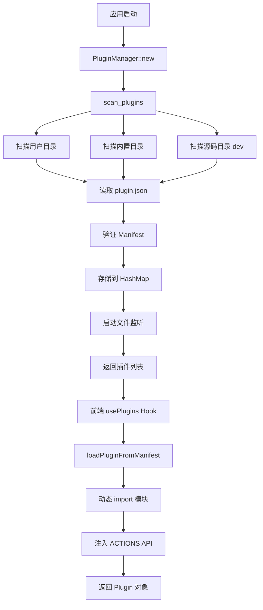
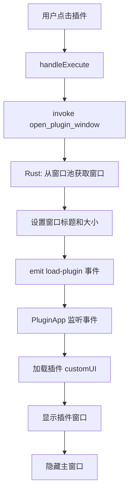

# Quick Actions 架构指南

## 📋 目录

- [项目概述](#项目概述)
- [技术栈](#技术栈)
- [系统架构](#系统架构)
- [核心模块](#核心模块)
- [数据流](#数据流)
- [安全模型](#安全模型)
- [扩展点](#扩展点)

---

## 🎯 项目概述

Quick Actions 是一个基于 **Tauri v2** + **React 19** 的桌面快速启动器应用，灵感来源于 macOS Spotlight 和 Alfred。它提供了一个高效的搜索界面，可以快速启动应用程序、执行命令、搜索文件以及运行各种插件。

### 核心特性

✅ **多窗口架构** - 搜索窗口和插件窗口分离  
✅ **插件系统** - 支持 JavaScript/ESM/HTML 三种插件类型  
✅ **安全 API** - ACTIONS API 提供受控的系统访问  
✅ **实时搜索** - 支持拼音、模糊匹配、子序列搜索  
✅ **图标缓存** - 异步加载并缓存应用图标  
✅ **Everything 集成** - 通过 CLI Sidecar 实现毫秒级文件搜索  
✅ **剪贴板历史** - 自动记录和管理剪贴板内容  

---

## 💻 技术栈

### 前端
- **React 19** - UI 框架
- **TypeScript** - 类型安全
- **HeroUI** - UI 组件库
- **TailwindCSS v4** - 样式系统
- **Vite 7** - 构建工具

### 后端
- **Rust** - 系统级编程语言
- **Tauri v2** - 桌面应用框架
- **winapi** - Windows API 绑定
- **window-vibrancy** - Acrylic 毛玻璃效果

### 插件开发
- **JavaScript/ES Module** - 插件运行时
- **Vite** - 插件构建工具
- **ACTIONS API** - 安全的系统访问接口

---

## 🏗️ 系统架构

### 整体架构图

```
┌─────────────────────────────────────────────────────────┐
│                    Quick Actions                         │
├──────────────────────┬──────────────────────────────────┤
│   Frontend (React)   │     Backend (Rust/Tauri)         │
│                      │                                  │
│  ┌────────────────┐  │  ┌────────────────────────────┐ │
│  │  Main Window   │  │  │   Plugin Manager           │ │
│  │  (Search UI)   │◄─┼──┤   - Scan & Load Plugins    │ │
│  └────────────────┘  │  │   - Watch for Changes      │ │
│                      │  └────────────────────────────┘ │
│  ┌────────────────┐  │  ┌────────────────────────────┐ │
│  │ Plugin Windows │  │  │   Command Handlers         │ │
│  │  (Pool x5)     │◄─┼──┤   - everything_search      │ │
│  └────────────────┘  │  │   - clipboard_*            │ │
│                      │  │   - storage_*              │ │
│  ┌────────────────┐  │  │   - plugin_*               │ │
│  │  Plugin Loader │  │  └────────────────────────────┘ │
│  │  - ESM Import  │  │  ┌────────────────────────────┐ │
│  │  - API Inject  │  │  │   Sidecar Processes        │ │
│  └────────────────┘  │  │   - es.exe (Everything)    │ │
│                      │  └────────────────────────────┘ │
│  ┌────────────────┐  │                                  │
│  │  ACTIONS API   │  │  ┌────────────────────────────┐ │
│  │  (Security)    │  │  │   File System              │ │
│  └────────────────┘  │  │   - Icon Cache             │ │
│                      │  │   - Plugin Storage         │ │
└──────────────────────┘  └────────────────────────────┘
```

### 窗口架构

#### 主窗口 (Main Window)
- **尺寸**: 780x64 (折叠) / 780x480 (展开)
- **特性**: 
  - Always on Top
  - Skip Taskbar
  - Transparent + Acrylic
  - No decorations

#### 插件窗口池 (Plugin Window Pool)
- **数量**: 5 个预创建窗口
- **尺寸**: 1200x800
- **特性**:
  - Normal window behavior
  - Show in taskbar
  - Resizable
  - Acrylic effect
  - Hidden by default

---

## 🔧 核心模块

### 1. Plugin Manager (Rust)

**位置**: `src-tauri/src/plugin_manager.rs`

**职责**:
- 扫描和加载插件（用户目录 + 内置目录 + 源码目录）
- 监听插件目录变化（使用 `notify` crate）
- 管理插件元数据和路径映射
- 提供插件查询接口

**关键数据结构**:
```rust
pub struct PluginManager {
    plugins: HashMap<String, PluginMetadata>,
    plugin_paths: HashMap<String, PathBuf>,
    plugin_dir: PathBuf,
    watcher: Option<notify::RecommendedWatcher>,
}
```

**扫描策略**:
1. 用户插件目录: `%APPDATA%/quick-actions/plugins`
2. 内置插件目录: `<exe_dir>/plugins`
3. 源码插件目录: `<project_root>/plugins` (开发模式)

### 2. Plugin Loader (TypeScript)

**位置**: `src/utils/pluginLoader.ts`

**职责**:
- 动态导入插件模块
- 根据 `entry_type` 选择加载策略
- 注入 ACTIONS API
- 处理不同类型的插件（JS/ESM/HTML）

**加载流程**:
```typescript
// JS 插件
const module = await import(assetUrl);
execute = async (query) => module.execute(query, api);

// ESM 插件 (React UI)
const module = await import(assetUrl);
if (module.render) {
  customUI = module;
}

// HTML 插件
execute = async () => [{ action: () => window.open(assetUrl) }];
```

### 3. ACTIONS API

**位置**: `src/utils/actionsAPI.ts`

**设计理念**: 提供安全的、受控的系统访问接口，避免直接暴露 `window.__TAURI__`

**API 模块**:
- `fs` - 文件系统操作（受限）
- `shell` - 命令执行（受限）
- `notification` - 系统通知
- `clipboard` - 剪贴板读写
- `storage` - 本地存储（插件隔离）
- `config` - 配置管理
- `utils` - 实用工具函数

**安全特性**:
- 每个 API 调用都经过 Rust 后端验证
- 文件系统访问有路径安全检查
- 命令执行可以配置白名单
- 数据存储按插件 ID 隔离

### 4. Search Engine

**位置**: `src/App.tsx`, `src/hooks/usePlugins.ts`

**功能**:
- 多源搜索（插件 + 应用程序）
- 拼音匹配（首字母 + 完整拼音）
- 模糊匹配（子序列 + 字符包含）
- 结果缓存（内存 + localStorage）

**匹配算法**:
```typescript
// 优先级从高到低
1. 直接包含匹配 (contains)
2. 子序列模糊匹配 (is_subsequence)
3. 宽松字符匹配 (contains_all_chars)
4. 拼音首字母匹配
5. 完整拼音匹配
```

### 5. Everything Integration

**位置**: `src-tauri/src/commands.rs`

**架构**: Tauri Sidecar 模式
- **二进制文件**: `libs/es-x86_64-pc-windows-msvc.exe`
- **配置**: `tauri.conf.json` → `externalBin`
- **调用方式**: `app.shell().sidecar("libs/es")`

**工作流程**:
```
用户输入 → Rust Command → es.exe → Everything IPC → JSON 结果 → Rust 解析 → 前端展示
```

**Sidecar 配置**:
```json
{
  "bundle": {
    "externalBin": ["libs/es"],
    "resources": {
      "libs/es-x86_64-pc-windows-msvc.exe": "libs/es-x86_64-pc-windows-msvc.exe"
    }
  }
}
```

### 6. Icon Cache System

**位置**: `src-tauri/src/commands.rs`

**功能**:
- 异步提取应用图标
- 磁盘缓存（SHA256 hash 命名）
- 内存缓存（LRU 策略）
- 后台线程处理

**缓存路径**: `%LOCALAPPDATA%/quick-actions/icon-cache/`

**性能优化**:
- 首次加载时异步提取所有图标
- 后续请求直接从缓存读取
- 缓存命中率 > 95%

---

## 🔄 数据流

### 插件加载流程



### 搜索执行流程


### 插件窗口打开流程



---

## 🔒 安全模型

### 权限层级

| API | 权限级别 | 风险 | 说明 |
|-----|---------|------|------|
| `notification` | Low | ✅ 低 | 仅显示通知 |
| `clipboard` | Low | ✅ 低 | 浏览器原生 API |
| `storage` | Low | ✅ 低 | localStorage，插件隔离 |
| `utils` | Low | ✅ 低 | 纯工具函数 |
| `fs` | Medium | ⚠️ 中 | 受限的文件系统访问 |
| `shell` | Medium | ⚠️ 中 | 受限的命令执行 |
| `config` | Medium | ⚠️ 中 | 配置管理 |

### 安全措施

1. **API 沙箱**
   - 插件只能访问 `window.ACTIONS`
   - 无法直接调用 `window.__TAURI__`
   - 所有系统调用经过 Rust 后端验证

2. **路径安全检查**
   ```rust
   fn is_safe_path(path: &str) -> bool {
       // 防止目录穿越
       !path.contains("..") && !path.starts_with("/")
   }
   ```

3. **命令白名单**（可配置）
   ```rust
   const ALLOWED_COMMANDS = &["dir", "ping", "ipconfig"];
   ```

4. **数据隔离**
   - 每个插件的 storage key 添加前缀: `{plugin_id}:{key}`
   - 配置文件按插件 ID 分隔

---

## 🔌 扩展点

### 1. 插件系统

**添加新插件类型**:
1. 在 `PluginEntryType` enum 中添加新类型
2. 在 `pluginLoader.ts` 中添加加载逻辑
3. 更新 `plugin.json` schema

**示例**: 添加 Python 插件
```typescript
else if (entryType === 'python') {
  execute = async (query) => {
    const output = await ACTIONS.shell.execute('python', [scriptPath, query]);
    return parsePythonOutput(output);
  };
}
```

### 2. 搜索源

**添加新的搜索源**:
1. 创建新的 Hook (如 `useBookmarks`)
2. 在 `App.tsx` 中合并结果
3. 实现匹配算法

**示例**:
```typescript
const { bookmarks } = useBookmarks();
const allResults = [...pluginResults, ...appResults, ...bookmarkResults];
```

### 3. 窗口行为

**自定义窗口效果**:
- 修改 `lib.rs` 中的窗口构建器
- 调整 Acrylic 颜色和透明度
- 添加自定义窗口装饰

**示例**: 添加阴影效果
```rust
use winapi::um::dwmapi::DwmSetWindowAttribute;
let shadow = 2u32; // DWMWA_WINDOW_CORNER_PREFERENCE
DwmSetWindowAttribute(hwnd, 33, &shadow, std::mem::size_of::<u32>() as u32);
```

### 4. Sidecar 集成

**添加新的外部工具**:
1. 下载二进制文件到 `src-tauri/libs/`
2. 重命名为 `{name}-{target_triple}.exe`
3. 在 `tauri.conf.json` 中配置 `externalBin`
4. 在 `build.rs` 中添加复制逻辑
5. 创建 Rust command 调用 sidecar

**示例**: 集成 ffmpeg
```rust
#[tauri::command]
pub async fn convert_video(input: String, output: String, app: AppHandle) -> Result<(), String> {
    let command = app.shell()
        .sidecar("libs/ffmpeg")
        .args(&["-i", &input, &output]);
    
    let output = command.output().await?;
    Ok(())
}
```

---

## 📊 性能指标

### 启动时间
- **冷启动**: ~2-3 秒
- **热启动**: <1 秒
- **插件扫描**: ~100-500ms (取决于插件数量)

### 搜索性能
- **本地搜索**: <10ms
- **Everything 搜索**: ~50-200ms
- **图标加载**: 首次 ~500ms，缓存后 <5ms

### 内存占用
- **基础应用**: ~50-80 MB
- **每个插件窗口**: ~30-50 MB
- **图标缓存**: ~5-10 MB

---

## 🛠️ 开发工作流

### 环境要求
- Node.js 18+
- Rust 1.70+
- pnpm 8+
- Windows 10/11 (主要平台)

### 常用命令
```bash
# 开发模式
pnpm tauri dev

# 构建生产版本
pnpm tauri build

# 创建新插件
node scripts/create-plugin.js my-plugin

# 运行测试
cargo test
```

### 调试技巧
1. **前端调试**: Chrome DevTools (F12)
2. **后端日志**: `%APPDATA%/com.develop.quick-actions/logs/`
3. **插件调试**: 在插件代码中使用 `console.log`
4. **性能分析**: React DevTools Profiler

---

## 📚 相关文档

- [多窗口架构](./MULTI_WINDOW_ARCHITECTURE.md)
- [ACTIONS API 指南](./ACTIONS_API_GUIDE.md)
- [Everything CLI 集成](./EVERYTHING_CLI_INTEGRATION.md)
- [窗口测试指南](./WINDOW_TEST_GUIDE.md)
- [拖拽修复说明](./DRAG_FIX.md)

---

## 🎯 未来规划

### 短期 (v0.2)
- [ ] 插件市场
- [ ] 主题系统
- [ ] 快捷键自定义
- [ ] 插件间通信

### 中期 (v0.3)
- [ ] 云同步
- [ ] AI 助手集成
- [ ] 工作流自动化
- [ ] 跨平台支持 (macOS/Linux)

### 长期 (v1.0)
- [ ] 插件签名验证
- [ ] 沙箱隔离
- [ ] 企业版功能
- [ ] 生态系统建设

---

**最后更新**: 2026-04-15  
**版本**: v0.1.0  
**维护者**: Quick Actions Team
