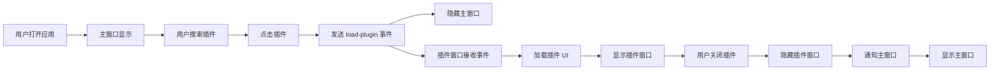

# 多窗口架构 - 搜索与插件分离

## 🎯 概述

将 Quick Actions 改造为多窗口架构，搜索界面和插件界面在独立的窗口中运行，提供更好的用户体验。

---

## 🏗️ 架构设计

### 窗口布局

```
┌─────────────────────┐     ┌──────────────────────────┐
│   Main Window       │     │   Plugin Window          │
│   (搜索界面)         │     │   (插件 UI)               │
│                     │     │                          │
│  - 搜索栏            │     │  - 完整的插件界面         │
│  - 插件列表          │     │  - 更大的显示空间         │
│  - 快捷键支持        │     │  - 独立的任务栏图标       │
│                     │     │  - 可调整大小             │
│  600x400            │     │  1200x800                │
│  Always on Top      │     │  Normal Window           │
│  Skip Taskbar       │     │  Show in Taskbar         │
└─────────────────────┘     └──────────────────────────┘
```

### 工作流程



---

## 📝 实现细节

### 1. Tauri 配置

**文件**: `src-tauri/tauri.conf.json`

```json
{
  "app": {
    "windows": [
      {
        "label": "main",
        "title": "Quick Actions",
        "width": 600,
        "height": 400,
        "center": true,
        "decorations": false,
        "alwaysOnTop": true,
        "skipTaskbar": true,
        "visible": false,
        "url": "index.html"
      },
      {
        "label": "plugin",
        "title": "Plugin UI",
        "width": 1200,
        "height": 800,
        "center": true,
        "decorations": true,
        "alwaysOnTop": false,
        "skipTaskbar": false,
        "visible": false,
        "url": "plugin.html"
      }
    ]
  }
}
```

**关键配置**:
- **主窗口**: 小尺寸、无边框、置顶、不在任务栏显示
- **插件窗口**: 大尺寸、有边框、正常窗口、在任务栏显示

---

### 2. 插件窗口 HTML

**文件**: `plugin.html`

```html
<!doctype html>
<html lang="zh-CN">
  <head>
    <meta charset="UTF-8" />
    <title>Plugin UI - Quick Actions</title>
  </head>
  <body>
    <div id="root"></div>
    <script type="module" src="/src/PluginApp.tsx"></script>
  </body>
</html>
```

---

### 3. 插件窗口应用

**文件**: `src/PluginApp.tsx`

```typescript
import { useState, useEffect } from 'react';
import { listen } from '@tauri-apps/api/event';
import { getCurrentWindow } from '@tauri-apps/api/window';
import { PluginUI } from './components/PluginUI';

export function PluginApp() {
  const [selectedPlugin, setSelectedPlugin] = useState<Plugin | null>(null);

  useEffect(() => {
    // 监听来自主窗口的插件加载事件
    const unlisten = listen('load-plugin', async (event) => {
      const pluginData = event.payload as Plugin;
      
      setSelectedPlugin(pluginData);
      
      // 显示窗口
      const currentWindow = getCurrentWindow();
      await currentWindow.show();
      await currentWindow.setFocus();
    });

    return () => {
      unlisten.then(fn => fn());
    };
  }, []);

  const handleClose = async () => {
    // 隐藏窗口而不是关闭
    const currentWindow = getCurrentWindow();
    await currentWindow.hide();
    setSelectedPlugin(null);
  };

  return (
    <div className="min-h-screen bg-gray-900">
      {selectedPlugin && (
        <PluginUI 
          plugin={selectedPlugin} 
          onClose={handleClose}
        />
      )}
    </div>
  );
}
```

**功能**:
- ✅ 监听 `load-plugin` 事件
- ✅ 接收插件数据
- ✅ 显示插件窗口
- ✅ 隐藏而非关闭窗口（保持状态）

---

### 4. 主窗口应用

**文件**: `src/App.tsx`

```typescript
import { emit } from '@tauri-apps/api/event';

const handleExecute = async (id: string, query: string) => {
  const plugin = plugins.find(p => p.id === id);
  if (!plugin) return;

  // 发送事件到插件窗口
  await emit('load-plugin', plugin);
  
  // 隐藏主窗口
  await invoke('hide_window');
};
```

**变化**:
- ❌ 移除了 `selectedPlugin` 状态
- ❌ 移除了 `PluginUI` 组件
- ✅ 通过事件系统通知插件窗口
- ✅ 点击插件后隐藏主窗口

---

### 5. 主入口文件

**文件**: `src/main.tsx`

```typescript
import { PluginApp } from "./PluginApp";

// 根据 URL 路径决定渲染哪个应用
const isPluginWindow = window.location.pathname.includes('plugin.html');

ReactDOM.createRoot(document.getElementById("root")).render(
  <React.StrictMode>
    {isPluginWindow ? <PluginApp /> : <App />}
  </React.StrictMode>,
);
```

**智能路由**:
- 如果是 `plugin.html` → 渲染 `PluginApp`
- 否则 → 渲染 `App`

---

### 6. Rust 后端命令

**文件**: `src-tauri/src/commands.rs`

```rust
/// 发射事件到前端
#[tauri::command]
pub fn emit_event(
    event: String,
    payload: serde_json::Value,
    window: WebviewWindow,
) -> Result<(), String> {
    window.emit(&event, payload).map_err(|e| e.to_string())?;
    Ok(())
}
```

**注册**: `src-tauri/src/lib.rs`
```rust
.invoke_handler(tauri::generate_handler![
    // ... 其他命令
    commands::emit_event,
])
```

---

## 🔄 通信流程

### 主窗口 → 插件窗口

```typescript
// 主窗口发送
await emit('load-plugin', plugin);

// 插件窗口接收
listen('load-plugin', (event) => {
  const plugin = event.payload;
  // 加载插件...
});
```

### 插件窗口 → 主窗口

```typescript
// 插件窗口发送
await invoke('emit_event', { 
  event: 'plugin-closed',
  payload: {} 
});

// 主窗口接收（如果需要）
listen('plugin-closed', () => {
  // 显示主窗口...
});
```

---

## 🎨 用户体验

### 优势

✅ **专注模式**
- 搜索时：小窗口，不干扰
- 使用插件时：大窗口，完整体验

✅ **任务栏管理**
- 主窗口：不在任务栏显示（类似 Spotlight）
- 插件窗口：在任务栏显示（正常应用）

✅ **窗口行为**
- 主窗口：始终置顶，快速访问
- 插件窗口：正常窗口，可最小化/最大化

✅ **性能优化**
- 插件窗口隐藏而非关闭
- 保持状态，快速切换

---

## 🧪 测试步骤

### 1. 启动应用

```bash
pnpm tauri dev
```

### 2. 测试主窗口

```
1. 按快捷键打开应用
2. 应该看到小窗口 (600x400)
3. 输入搜索关键词
4. 看到插件列表
```

### 3. 测试插件窗口

```
1. 点击任意插件
2. 主窗口应该隐藏
3. 插件窗口应该打开 (1200x800)
4. 在任务栏可以看到插件窗口
```

### 4. 测试窗口切换

```
1. 关闭插件窗口
2. 应该返回到搜索界面
3. 可以再次搜索其他插件
```

---

## 🐛 常见问题

### Q1: 插件窗口没有打开？

**检查**:
1. 控制台是否有错误
2. `load-plugin` 事件是否发送成功
3. 插件窗口是否正确监听事件

**调试**:
```javascript
// 在主窗口
console.log('Emitting event...');
await emit('load-plugin', plugin);

// 在插件窗口
listen('load-plugin', (event) => {
  console.log('Received:', event);
});
```

### Q2: 窗口大小不对？

**检查**: `tauri.conf.json` 中的窗口配置

### Q3: 插件窗口无法关闭？

**确保**: 调用 `window.hide()` 而不是关闭窗口

---

## 🚀 未来扩展

### 1. 窗口位置记忆

```typescript
// 保存窗口位置
const position = await window.outerPosition();
localStorage.setItem('plugin-window-pos', JSON.stringify(position));

// 恢复窗口位置
const saved = localStorage.getItem('plugin-window-pos');
if (saved) {
  const pos = JSON.parse(saved);
  await window.setPosition(pos);
}
```

### 2. 多插件同时运行

允许多个插件窗口同时打开：

```typescript
// 为每个插件创建唯一标签
const label = `plugin-${plugin.id}-${Date.now()}`;
```

### 3. 插件间通信

```typescript
// 插件 A 发送消息
emit('plugin-message', { from: 'A', to: 'B', data: {...} });

// 插件 B 接收
listen('plugin-message', (event) => {
  if (event.payload.to === 'B') {
    // 处理消息
  }
});
```

---

## 📊 对比

| 特性 | 单窗口 | 多窗口 |
|------|--------|--------|
| **搜索体验** | ⭐⭐⭐ | ⭐⭐⭐⭐⭐ |
| **插件体验** | ⭐⭐⭐ | ⭐⭐⭐⭐⭐ |
| **任务栏管理** | ⭐⭐ | ⭐⭐⭐⭐⭐ |
| **窗口切换** | ⭐⭐⭐ | ⭐⭐⭐⭐ |
| **实现复杂度** | ⭐ | ⭐⭐⭐ |
| **内存占用** | 低 | 中 |

---

## 🎉 总结

多窗口架构提供了：

✅ **更好的搜索体验** - 小而快的搜索窗口  
✅ **完整的插件体验** - 大而全的插件窗口  
✅ **灵活的任务栏管理** - 按需显示  
✅ **流畅的窗口切换** - 隐藏/显示机制  

现在 Quick Actions 拥有类似 macOS Spotlight + 独立应用的混合体验！🚀
